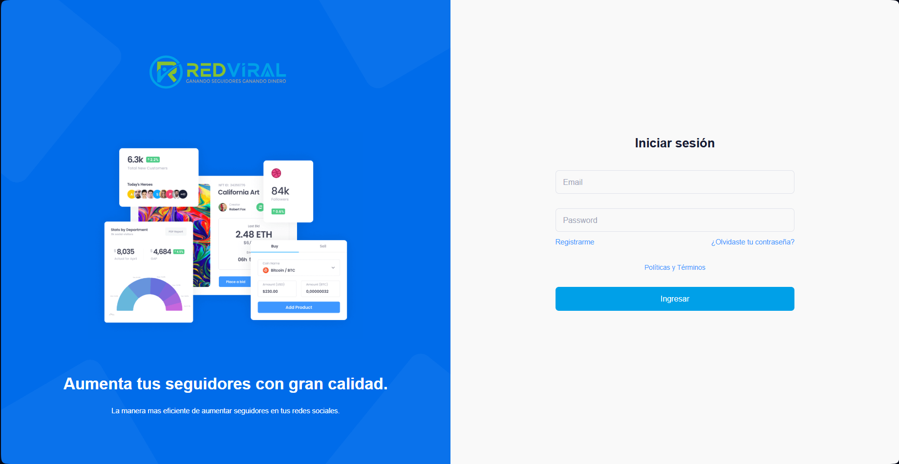
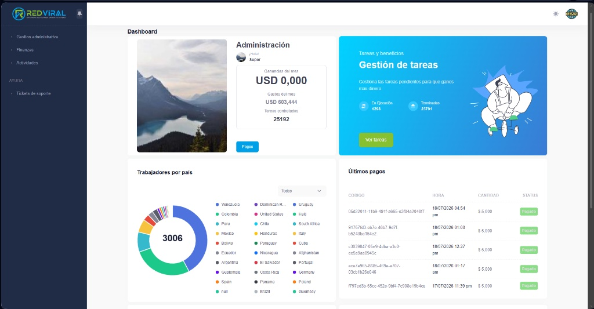
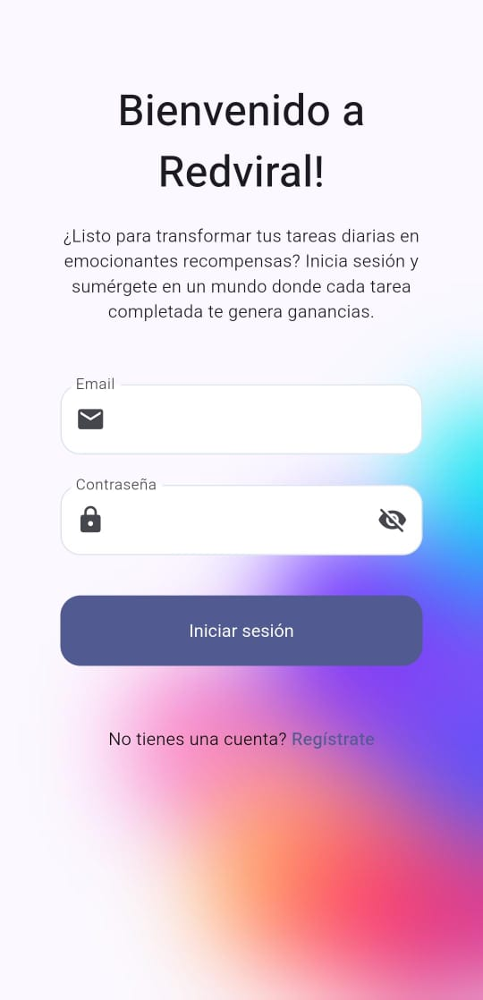
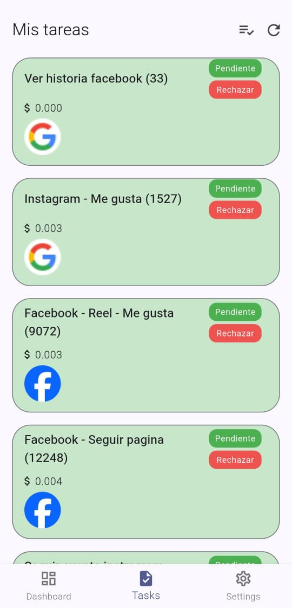

# Hey 👋, Full Stack Engineer & Digital Architect here

A passionate Full Stack Developer focused on building end-to-end applications, robust architectures, and scalable digital ecosystems.

---

### 👤 About Me

* 🚀 **Full Stack Expert** – Building scalable cross-platform apps with clean, maintainable code.
* 🖥️ **Backend Architect** – Expert in robust APIs, database optimization, and secure multi-container environments.
* 🌐 **Frontend Focused** – Crafting responsive interfaces and interactive 3D web environments.
* 📱 **Mobile Developer** – Experienced in creating high-performance, native-like mobile experiences.

---

### 🛠️ Technologies & Tools

#### Backend & Database
      

#### Frontend Development
     

#### Mobile Development
 

#### Tools & Others
   

---

### 🗂️ Featured Projects

#### RedViral – Plataforma de Automatización SMM
**Desarrollo a Medida para Cliente Corporativo**

Plataforma empresarial diseñada e implementada para la automatización, sincronización y gestión de servicios de Social Media Marketing (SMM), conectando flujos de trabajo web con una aplicación móvil dedicada para los operarios.

**Retos técnicos resuelvos:**
* ⚙️ **Sincronización Automatizada:** Optimización de tareas programadas y sincronización de órdenes en tiempo real entre el backend y los dispositivos móviles de los trabajadores.
* 🌐 **Despliegue y Enrutamiento en VPS:** Configuración y administración del servidor en un Droplet de DigitalOcean, gestionando el entorno de producción directamente sobre Linux.
* 🔀 **Orquestación con Nginx:** Configuración avanzada de Nginx como servidor web y proxy inverso, estructurando el backend y el frontend de forma independiente en rutas y directorios del sistema aislados para optimizar el rendimiento y la seguridad.
* 🛡️ **Seguridad y Flujos Críticos:** Implementación de autenticación segura basada en JWT/2FA y optimización de consultas complejas en MySQL para mantener la consistencia de los datos bajo alta demanda.

**Logos de las Tecnologías Principales Utilizadas:**
    

---

#### 💻 Interfaz Web (Panel de Administración y Login)

Demostración de la plataforma web responsiva para la gestión de la red.

| Pantalla de Inicio de Sesión Web | Dashboard de Administración |
|---|---|
|  |  |

---

#### 📱 Aplicación Móvil (Login y Gestión de Tareas)

Vistas de la aplicación nativa para usuarios finales, enfocada en la facilidad de uso y la gestión de tareas diarias.

| Pantalla de Bienvenida y Login Móvil | Listado de Tareas Pendientes |
|---|---|
|  |  |

---

📫 **How to reach me:**
* **LinkedIn:** [argijrr](https://www.linkedin.com/in/argijr)
* **Email:** argimirojrodriguezrr@gmail.com